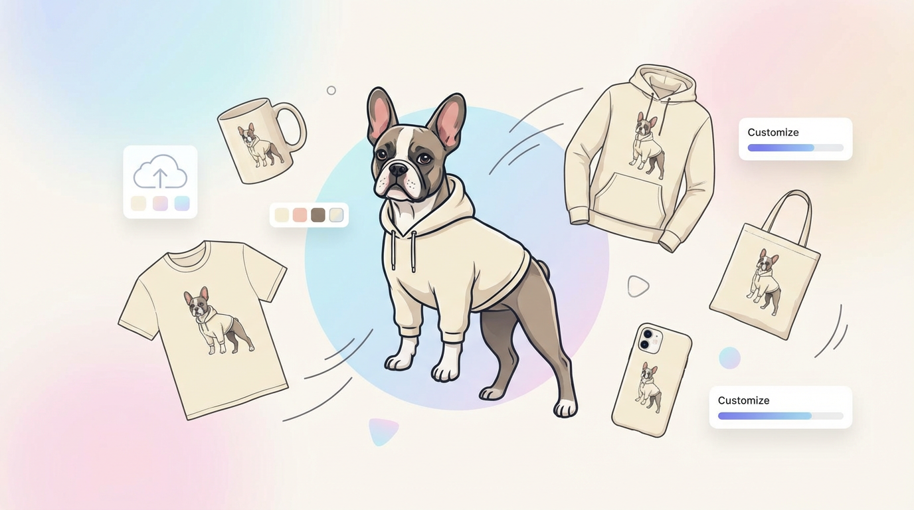

<div align="center">
  
</div>

## Dog Drop

**Turn your dog pics into high‑fashion merch in a few clicks.**

Dog Drop is a React + Vite app powered by Gemini that lets you:

- **Upload a photo** of your dog (or drag & drop it in).
- **Pick a product** like a mug, tee, hoodie, tote, socks, or phone case.
- **Choose a vibe** (Ivy League, 90s New York, British Countryside, Tokyo Streets, etc.) or write your own.
- **Generate a print‑ready design** using AI and preview it in an interactive UI.
- **Walk through a faux checkout** flow that feels like a real DTC merch store.

Designed to feel like a polished, modern ecommerce experience rather than a dev demo.

---

## Tech stack

- **Frontend**: React 19, TypeScript, Vite
- **UI/UX**: Tailwind CSS, `motion` for animations, `lucide-react` icons
- **Audio**: `howler` for delightful micro‑interactions
- **AI**: `@google/genai` (Gemini) for prompt‑driven image generation
- **Tooling**: TypeScript, Vite dev server, simple `tsc` lint script

---

## Getting started

**Prerequisites**

- **Node.js** (LTS recommended)
- A **Gemini API key**

**1. Install dependencies**

```bash
npm install
```

**2. Configure environment**

Create a `.env` file in the project root (if it doesn’t already exist) and add:

```bash
GEMINI_API_KEY=your_api_key_here
```

Never commit this file; it should already be git‑ignored.

**3. Run the dev server**

```bash
npm run dev
```

By default, Vite will start the app on `http://localhost:3000`.

---

## Usage walkthrough

- **Step 1 – Upload**  
  Drag and drop a dog photo or use the upload button. You’ll get subtle sounds and motion to confirm the upload.

- **Step 2 – Choose product**  
  Select from mugs, tees, hoodies, socks, tote bags, or phone cases. Each option shows a price and icon.

- **Step 3 – Pick a theme & style**  
  Choose from curated themes like **Ivy League**, **90s New York**, **British Countryside**, **Parisian Maison**, **Italian Riviera**, **Tokyo Streets**, **Vintage Americana**, **LA Cool**, or define a **Custom** aesthetic.

- **Step 4 – Generate**  
  Hit generate and let Gemini create a tailored design. Dynamic loading messages and sound effects keep it feeling alive.

- **Step 5 – (Optional) Mock checkout**  
  Explore a high‑touch checkout experience with shipping, payment, and confirmation states.

---

## Scripts

```bash
npm run dev      # Start dev server
npm run build    # Production build
npm run preview  # Preview production build
npm run lint     # Type-check the project
```

---

## Project goals

- **Delightful UX**: Treat AI as part of a polished product, not just a textarea with a button.
- **High‑fashion dog merch**: Explore how AI can turn everyday pet photos into brand‑worthy visuals.
- **Showcase**: Serve as a reference for building modern, animated AI experiences with React + Gemini.

---

## Roadmap ideas

- **Real checkout integration** with a commerce provider.
- **Persistent design gallery** backed by a database.
- **Shareable links** for designs and collections.
- **Fine‑tuned prompts** per product + theme combo.
- **Multi‑pet support** and advanced composition controls.

---

## License

SPDX-License-Identifier: Apache-2.0
